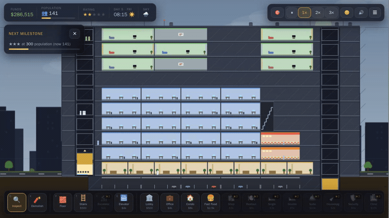
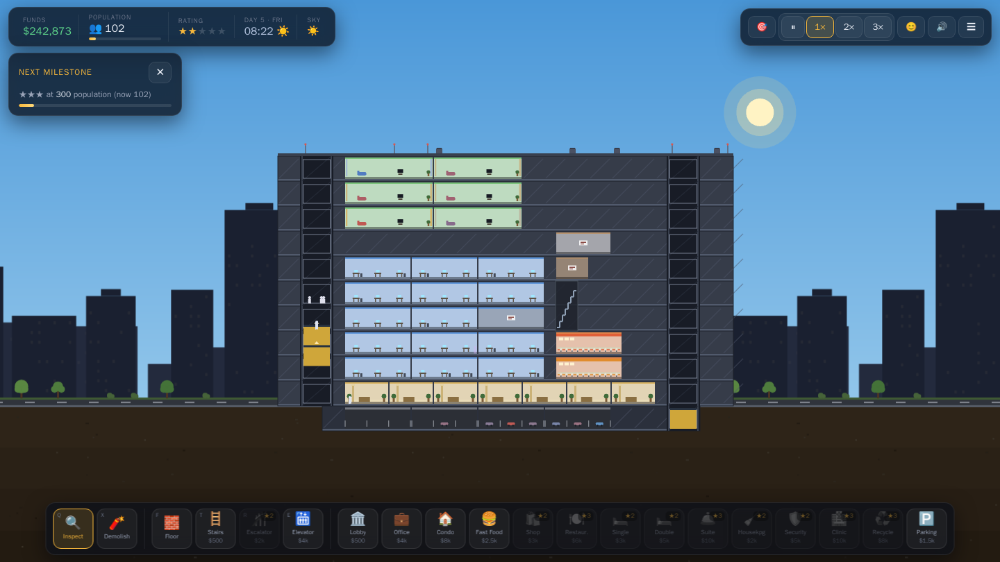
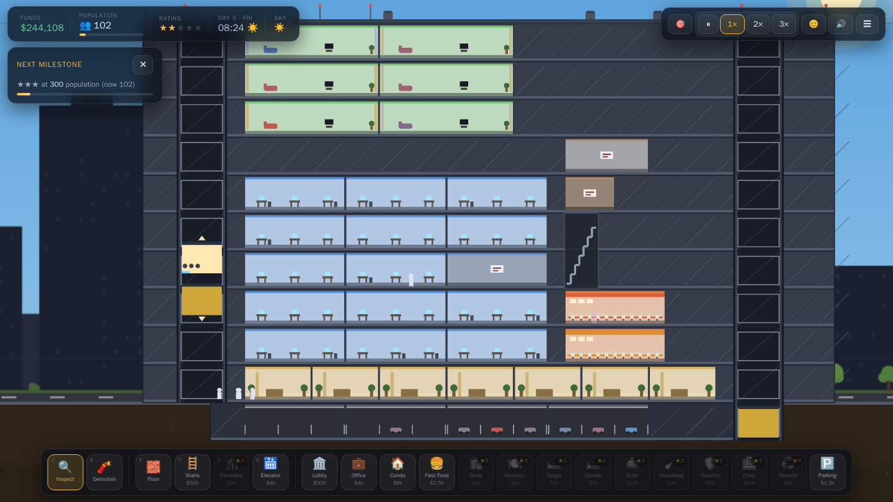
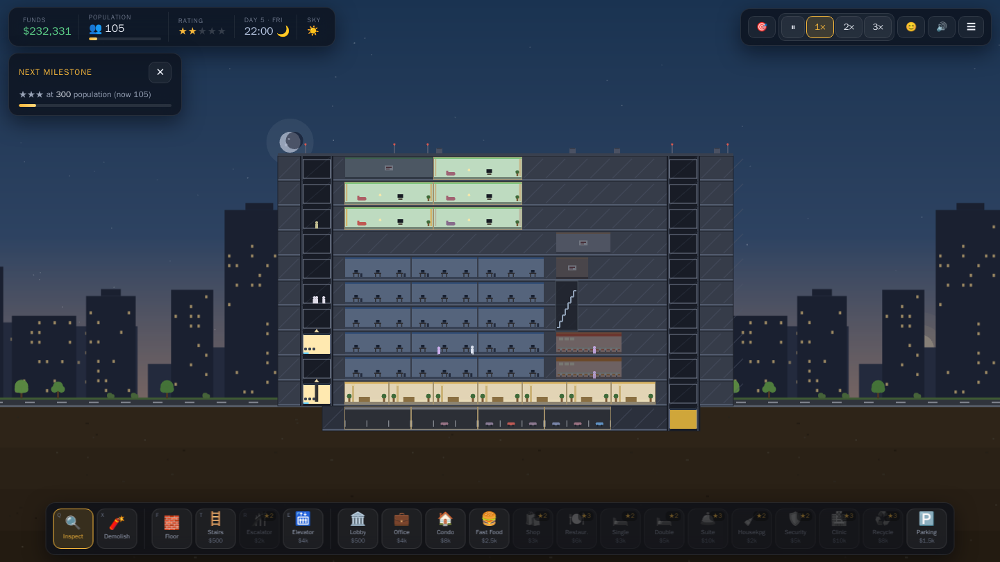
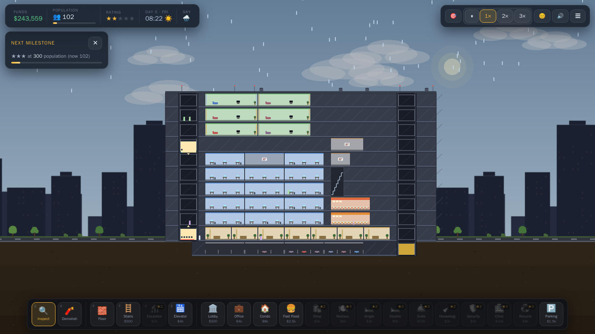

# Browser Sim Tower

A browser-based tower building and simulation game, inspired by the classic
elevator-and-tenants tower sims of the '90s. Build a vertical tower of lobbies,
offices, condos, hotels and shops, connect it with elevators, stairs and
escalators, and keep a live economy of tenants happy as you climb from
★ to ★★★★★.



The sky behind your tower mirrors your **real local weather and time of day**
(clear, cloudy, rain, snow, night). It's pure ambience — the simulation never
depends on it, and the game is fully playable offline.

> **Privacy:** the weather backdrop is optional. If you allow it, the browser's
> coarse geolocation is sent directly to [Open-Meteo](https://open-meteo.com)
> (no API key, no backend, no account) to look up local conditions; the last
> result and coordinates are cached only in your browser's `localStorage`.
> Deny location and it falls back to a default sky. No data leaves your machine
> except that one direct weather request.

<table>
<tr>
<td width="50%"></td>
<td width="50%"></td>
</tr>
<tr>
<td width="50%"></td>
<td width="50%"></td>
</tr>
</table>

<sub>Every room has a hand-drawn interior and elevator cars carry visible passengers. The demo and screenshots are captured from this game — no third-party art assets are bundled; everything on screen is drawn procedurally.</sub>

## Running the game

You'll need [Node.js](https://nodejs.org) 20+ and npm.

```bash
npm install      # first time only
npm run dev      # start the Vite dev server
```

Then open **http://localhost:5173** in your browser.

<details>
<summary>Prefer Docker? (no local Node needed)</summary>

```bash
docker compose run --rm dev npm install
docker compose up dev
```

</details>

Your tower autosaves to the browser's localStorage (daily in sim time and every
~30 seconds when something changed), so you can close the tab and pick up where
you left off. Use **Export**/**Import** in the ☰ menu to back up a save as a file.

## How to play

### Getting started

1. Select **Lobby** in the build dock and click on the ground line — every
   tower starts with a lobby, and everyone enters the tower through one. Place
   a few side by side to widen your entrance.
2. Place **Offices** on the upper floors — rooms auto-build the structure they
   need, and dragging horizontally places a whole row at once.
3. Select **Elevator** and drag *vertically* from the ground floor upward. The
   shaft builds its own landings through existing construction. Rooms with a
   red ⚠ have no route people can actually travel — they stay vacant and earn
   nothing until you connect them.
4. Pick a speed (1×–3×) and watch tenants move in through the day — vacant
   offices and condos roll for tenants every business hour.
5. The **Getting started** card (top left) walks you through your first
   milestones, then tracks progress toward your next star.

### Money

| Source | How it pays |
|---|---|
| Office | Rent every quarter (4 days), weekdays only crowd |
| Condo | One-time sale when a resident buys it |
| Hotel rooms | Per occupied night, checkout at 08:00 |
| Retail (fast food, shop, restaurant) | Per customer visit, settled daily |
| Upkeep | Support rooms, retail, elevators & escalators charge quarterly |

Construction is gated on affordability — you can't go into debt building, but
quarterly upkeep can push you negative, so keep income ahead of costs.

### The elevator game

Elevator wait time is the heart of the simulation. Waits drive **satisfaction**;
low satisfaction makes offices and condos move out, hotels book fewer guests and
shops lose customers. Watch morning (07:00–09:00), lunch and evening rush hours.
Click an elevator with **Inspect** to add cars ($1,000) or extend its range.
Stairs work for short hops (people climb at most 4 flights); escalators are
great between retail floors.

### Stars and unlocks

Population milestones raise your star rating, unlock new room types and raise
the height limit:

- **★★ at 80 pop:** hotels, shops, escalators, housekeeping, security
- **★★★ at 300 pop:** restaurants, suites, medical, recycling
- **★★★★ at 900 pop** and **★★★★★ at 2,200 pop:** taller and deeper limits

### Tips

- **Hotels need Housekeeping** within 10 floors — dirty rooms can't re-rent.
- **Parking** (basement) makes offices lease faster and retail busier; it must
  connect to the lobby (stairs or an elevator that reaches below ground).
- Keep **noisy rooms** (fast food, restaurants) away from condos and hotel
  rooms — placement next to them is blocked, and neighbours hate the racket.
- **Security** and **Medical** boost satisfaction for everything within 15 floors.
- At ★★★ and up, big towers need **Recycling Centres** (one per 1,500 population)
  or everyone gets grumpy.
- Toggle the 😊 **Mood** button to see satisfaction as a heat map.
- The ☰ menu can switch the sky between your **real local time** and the
  **in-game clock** (weather stays real either way).

### Controls

| Input | Action |
|---|---|
| Left click / drag | Use the selected tool (drag rows of rooms, floors, elevator ranges) |
| Right or middle drag | Pan the camera (Inspect + drag empty space also pans) |
| Right *click* | Cancel back to Inspect |
| Mouse wheel | Zoom |
| `Space` | Pause / resume |
| `1` `2` `3` | Simulation speed |
| `Q` / `Esc` | Inspect (Esc also closes panels) |
| `X` `F` `T` `R` `E` | Demolish · Floor · Stairs · Escalator · Elevator |
| `G` / `Home` | Jump back to the lobby |
| `H` | Help |

## Development

```bash
npm test          # run tests once (Vitest + fast-check)
npm run lint      # eslint, incl. the core/Phaser import boundary
npm run build     # type-check + production build
```

The simulation core (`src/core`, `src/save`) is pure TypeScript with zero
Phaser imports — it runs headless, which is what the property-based tests
exercise. Phaser (`src/game`) only renders state and translates input into
engine commands. See [`ARCHITECTURE.md`](ARCHITECTURE.md) for the full design
notes, and [`CONTRIBUTING.md`](CONTRIBUTING.md) if you'd like to help out.

## License

Copyright © 2026 Gordon Murray. Released under the
[Apache License 2.0](LICENSE).
